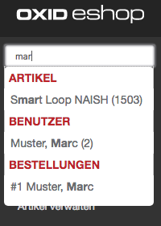

Great module proudly presented by [OXID Hackathon 2017](https://openspacer.org/12-oxid-community/185-oxid-hackathon-nuernberg-2017/) ;-)

Module version for OXID eShop 6. See here for [V4](https://github.com/OXIDprojects/adminsearch/tree/oxid4).

# Features

	Global admin search for
	- articles
	- categories
	- cms pages
	- users
	- orders
	- vendors
	- manufacturers
	- modules

# Installation

```
composer require oxid-community/adminsearch
```

# Screenshot




# Changelog

	2017-12-10	1.0.2	fix search class using module settings 
	2017-12-09	1.0.1	add translation, fix article search oxartnum
	2017-12-09	1.0.0	module release
